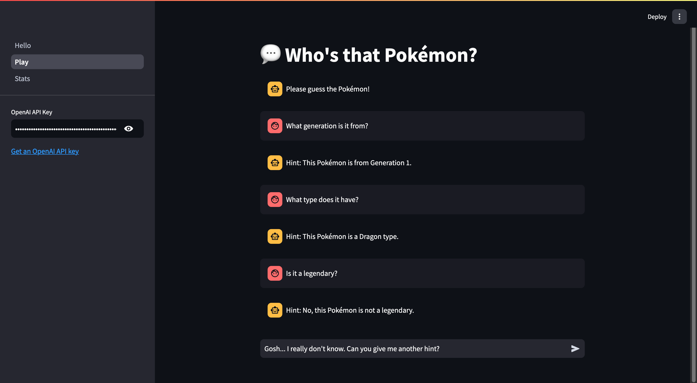

# Who's That Pokémon? - A Streamlit & AI Guessing Game

Welcome to **Who's That Pokémon?** An interactive guessing game built with [Streamlit](https://streamlit.io/) and powered by [OpenAI's GPT](https://platform.openai.com/)! The objective is simple: guess the name of a Pokémon based on hints provided by the AI assistant. You can [play the game here!](https://ai-guessing-game-gitfoe.streamlit.app/)



## Features

- **Interactive Chat Interface**: Engage with an AI-powered assistant that provides hints about a randomly selected Pokémon from generations 1 to 7.
- **Scoring System**: Your guessing performance is evaluated by a judge model, which rates your accuracy on a scale of 1 to 10.
- **Game Statistics**: Track your gameplay stats, including total games played, number of guesses, hints used, and judge ratings.
- **Session Persistence**: Your progress is automatically saved to disk, allowing you to resume your game anytime.
- **Game Statistics Dashboard**: The app also features a detailed statistics page that shows data such as the total guesses and the judge's rating.

## Background

I developed this game as part of a course in my Master's program in Cognitive Science. This course focuses on the application of AI technologies within web applications.

## Getting Started

### 1. Clone the Repository

```bash
git clone https://github.com/Gitfoe/ai-guessing-game
cd ai-guessing-game
```

### 2. Install the Dependencies

Ensure you have [Python 3.10+](https://www.python.org/downloads/) installed. Then, install the required packages:

```bash
pip install -r requirements.txt
```

### 3. Run the Application

```bash
streamlit run Hello.py
```

### 4. OpenAI API Key

To access the GPT-powered assistant, you need an [OpenAI API key](https://platform.openai.com/account/api-keys). You can enter your API key directly in the sidebar when running the app. This API key is only saved in memory.

## Project Structure

```
.
├── Hello.py                    # Landing page
├── pages/
│   └── Play.py                 # Chat interface and game logic
│   └── Stats.py                # Statistics dashboard
├── data/
│   └── pokemon.csv             # Pokémon dataset
│   └── session_state.json      # JSON file for saving session state
│   └── play_screenshot.png     # Screenshot for README
├── requirements.txt            # Python dependencies
├── README.md                   # Project documentation
├── LICENSE                     # Apache license
└── .gitignore                  # Files to ignore in Git
```

## Configuration

### Session State Persistence

The game automatically saves your session state to `session_state.json` after each game. This includes:
- Number of guesses per game
- Number of hints per game
- Ratings and explanations from the judge model

If you want to reset your progress, simply delete the `session_state.json` file in the `data` folder.

## License

This project is licensed under Apache License 2.0. See the [LICENSE](LICENSE) file for details.

## Acknowledgments

- [Streamlit](https://streamlit.io/) for the interactive web app framework.
- [OpenAI](https://openai.com/) for the GPT-4o-mini language model.
- [Rounak Banik](https://www.kaggle.com/datasets/rounakbanik/pokemon) and [Serebii](http://serebii.net/) for the Pokémon data.